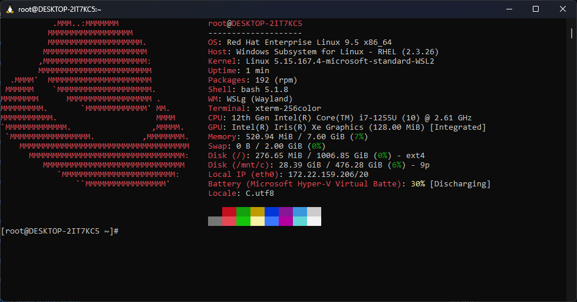

# RHEL for WSL



This is based on the RHEL UBI images without any modifications, other than a `dnf upgrade` and `dnf clean all`.

1. Extract the ZIP from Releases
2. Run `install.cmd`.
3. Done!

> [!NOTE]  
> If you have installed this before, or already have a distro named `RHEL` installed, run this in an elevated Command Prompt:
> ```
> wsl --unregister RHEL
> ```
> And if you have installed this before, run this as well:
> ```
> rd %systemdrive%\RHEL-WSL /s /q
> ```
